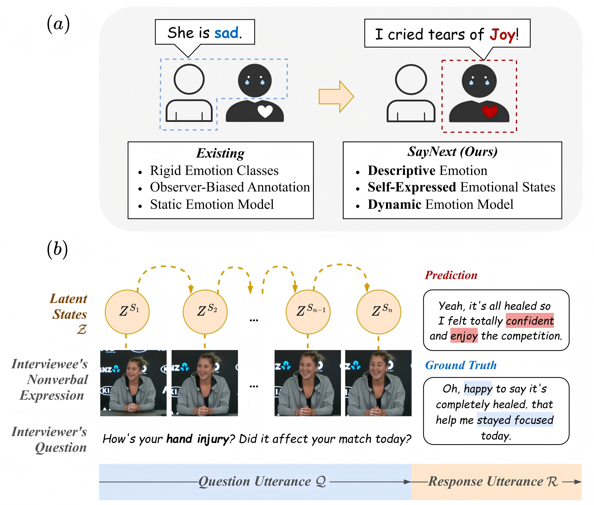

# Official PyTorch Implementation of SayNext-Chat.




> [**SayNext: A Novel Benchmark for Multimodal Emotion Understanding via Next-Utterance Prediction**]<br>
> [Yueyi Yang](https://www.oulu.fi/en/researchers/yueyi-yang), [Haotian Liu](https://scholar.google.com/citations?user=KKHgvSUAAAAJ&hl=en), [Haoyu Chen](https://mikecheninoulu.github.io/)<br>
 University of Oulu


## 📰 News

**[2025.3.19]** Welcome to **watch** this repository for the latest updates.


## :croissant: Datasets
The dataset application link will open later.


## :hugs: Models Download


### <div id="SayNext-Chat-models">(1) SayNext-Chat models</div>
| Model label          |   Finetune modules               |                        Link                                      |
|:------------------------------------|:--------------------------------------|:---------------------------------------------------:| 
| SayNext-Chat-M (Best)    |			VAE+LLM		   |     [SayNext-Chat-M](https://huggingface.co/YoeYang/SayNext-Chat-M)|
| SayNext-Chat-S    |			LLM		   |     [SayNext-Chat-S]|
| SayNext-Chat-L    |			VAE+LLM+ViT		   |     [SayNext-Chat-L]|


### <div id="Pre-trained-VAE-models">(2) Pre-trained VAE models</div>
| Model label         |   Evaluation protocol               |                        Link                     |
|:--------------------|:------------------------------------|:------------------------------------------------:| 
| TBD   |			TBD 	   |     [TBD ]|


## 🔨 Installation

1. Creating conda environment

```bash
conda create -n SayNext python=3.9
conda activate SayNext
```

2. Download this repo. 
```bash
git clone https://github.com/YoeYang/SayNext.git
cd SayNext
```

3. Download the packages in requirements.txt 

```bash
pip install -r requirements.txt 
```


## 🚀 Quick Start

### (1) Examples inference

To test model with examples, run command:

```bash
python test-fintune-8b-lora-iMiGUE-oneturn-xframes.py --gpu 0 --max_segments 16 --indir /scratch/project_2011211/yyy/CV2025/dataset/sub_dep_dataset/test_dataset.csv --outdir /scratch/project_2011211/yyy/CV2025/baseline_finetune/intern8b_sub_dep_4f_10e.csv
```

### (2) Customized test data

To test your own data, please follow these steps:
1. **Prepare your own data in csv format**: You need to generate video path, question and answer in csv format. Every line in csv file is one sample.
2. **Choose model in test.py**: You need to select a suitble model to inference. Editing the model path in test program.


## :stars: Finetune

You can finetune the model on your customized data. You need to follow the data format and edit your training shell.
Details will be upload later.


## ✏️ Citation
If you find this work useful for your research, please feel free to leave a star⭐️ and cite our paper:

```bibtex
@misc{yang2025saynext,
      title={SayNext: A Novel Benchmark for Multimodal Emotion Understanding via Next-Utterance Prediction}, 
      author={Yueyi Yang and Haotian Liu and Haoyu Chen},
      year={2025},
      eprint={arXiv:2403.xxxxx}, 
      archivePrefix={arXiv},
      primaryClass={cs.CL}
}
```

## 🤝 Acknowledgement
This work is supported by . Thanks to [InternVL](https://github.com/OpenGVLab/InternVL), [Exp-BLIP](https://github.com/Yujianyuan/Exp-BLIP). Our codes are based on these works.
